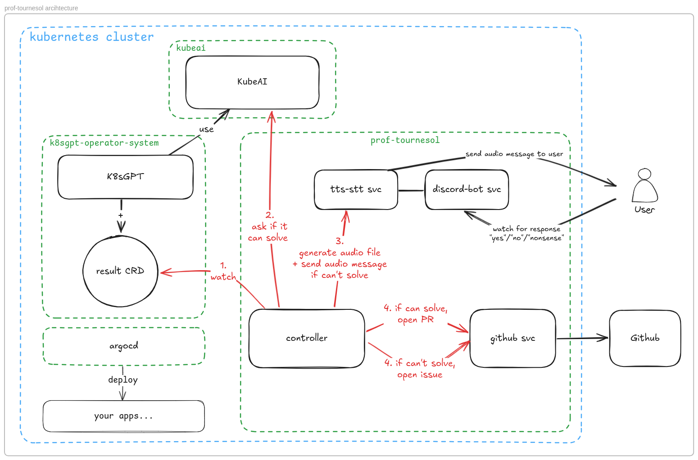

# prof-tournesol

Fix your Kubernetes errors with AI. 🌻

## Goals

1. Connecting to a log system to detect Kubernetes errors
2. Attempting automatic error resolution via a model
3. If successful, automatically opening a pull request
4. If unsuccessful, making an AI-powered phone call to the on-call person
    - explaining the error verbally (the speech)
    - asking them to intervene
5. Logging the following information in a file:
    - time of the call
    - number called
    - speech used
    - response (boolean) to the question: can they intervene?

## Architecture



## How to use

Setup environment variables:

```bash
cp .env.example .env
vim .env
```

Setup your custom values with the credentials for your GitHub App + Discord bot + your Discord ID:

```bash
cp values.yaml.example values.yaml
vim values.yaml
```

Create a k8s cluster with our application + kubeai + k8sgpt + argocd:

```bash
just init
```

Add config files for a model (gemma3-1b) and k8sgpt to use it:

```bash
kubectl apply -f ./manifests/gemma3-1b-model.yaml
kubectl apply -f ./manifests/k8sgpt-config.yaml
```

You should wait for a while for the model to be ready, and everything to be up and running.

Once everything is ready, you can start the application that will fail:

```bash
kubectl apply -f ./manifests/argocd-hof-app.yml
```

If `Prof. Tournesol (Bot)` can solve the error, you will receive a **pull request in your GitHub repository**.

If `Prof. Tournesol (Bot)` can't solve the issue, you will receive an **issue on your GitHub repository** & an **audio in your Discord DM** where you can also respond with an audio.
